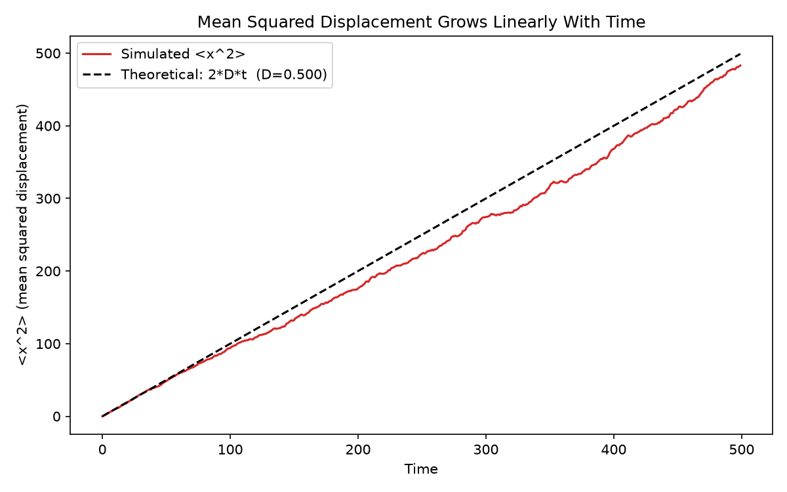
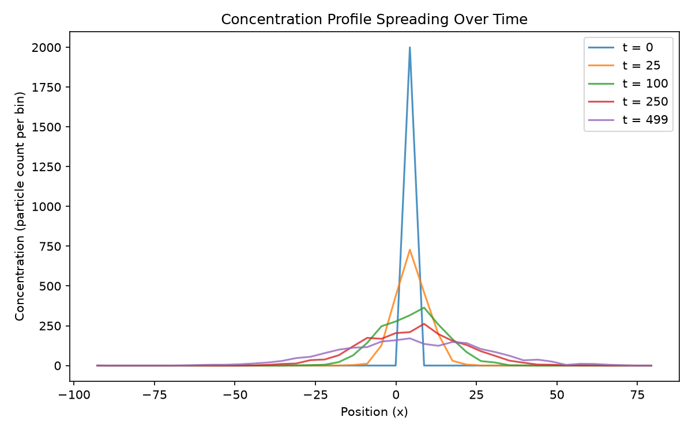
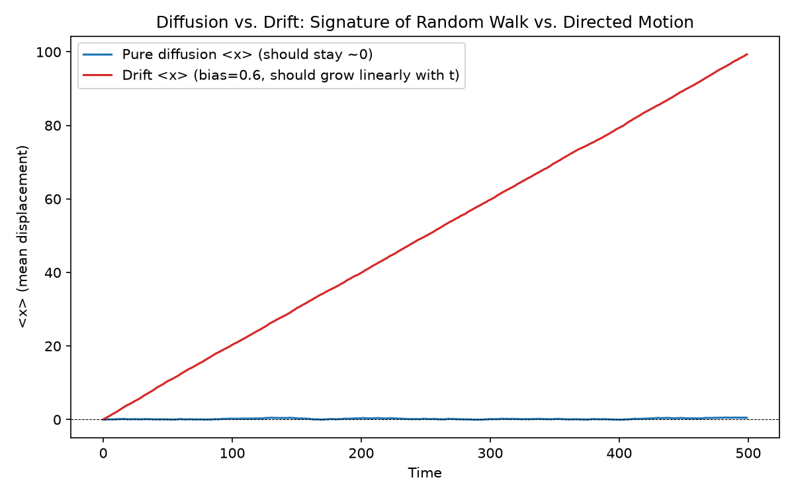

# Neural Computation — From Ions to Spikes

I'm working through [MIT OCW 9.40 (Introduction to Neural Computation)](https://ocw.mit.edu/)
on my own, and building a small simulation project for each lecture as I go,
to make sure I actually understand the material instead of just recognizing
the formulas.

The eventual goal is to end up with a simulated spiking neuron
(Hodgkin-Huxley model) built from scratch, but I'm taking it one lecture at
a time and only building each piece once I've actually covered it in the
course.

## Roadmap

- [x] **Lecture 1 — Ionic Diffusion & Drift**: random walk simulation, Fick's
  First Law, Ohm's Law in solution →
  [`lectures/01-ionic-diffusion-drift`](lectures/01-ionic-diffusion-drift)
- [ ] **Lecture 2 — Nernst Potential**: equilibrium potentials per ion species
- [ ] **Lecture 3 — RC Neuron Model**: passive membrane, resting potential,
  response to injected current
- [ ] **Lecture 4 — Hodgkin-Huxley**: voltage-gated channels, simulated
  action potentials

I'll update this as I go through the course — each lecture gets its own
folder and its own README with more detail.

## Module 1: Ionic Diffusion & Drift

My first project, covering the two mechanisms that move ions in solution —
random diffusion and electrically-driven drift. I simulated each one from
scratch (particle-by-particle) instead of just plugging numbers into the
formulas from the slides, to actually see the behavior the equations are
describing.

**`random_walk.py`** — simulates many particles doing independent 1D random
walks, then checks that:
- ⟨x⟩ ≈ 0 over time (diffusion is unbiased — no net drift)
- ⟨x²⟩ = 2Dt (mean squared displacement grows linearly with time)
- The diffusion coefficient D I get from fitting the simulated data matches
  the theoretical D = δ²/(2τ) from the step size and step duration I chose



**`diffusion_fick.py`** — simulates diffusion starting from a clustered
"drop of dye," then builds a concentration profile and flux straight from
where the particles ended up (histogram + finite differences), to see
Fick's First Law (J = -D·∂C/∂x) show up on its own from a bunch of random
walkers, instead of assuming the continuum equation from the start.



**`drift_ohms_law.py`** — looks at how resistance scales with geometry
(R = ρL/A), and compares plain diffusion against a biased "drift" random
walk side by side. This was the plot I most wanted to see for myself:
diffusion's mean position stays near zero while its spread grows as √t,
but drift's mean position grows in a straight line with t — apparently
that's the signature that tells you whether particles are just diffusing
or being pushed by a field.



**`utils.py`** — the simulation code shared across all three scripts above,
so I wasn't copy-pasting the same random walk logic everywhere.

More detail (including bugs I ran into and things I'm still unsure about)
is in the [Lecture 1 README](lectures/01-ionic-diffusion-drift/README.md).

### Running it

```bash
pip install -r requirements.txt
cd lectures/01-ionic-diffusion-drift
python random_walk.py
python diffusion_fick.py
python drift_ohms_law.py
```

Each script has `# %%` cell markers so I could run them cell-by-cell in
VS Code with the Jupyter extension, instead of re-running the whole
simulation every time I wanted to tweak a parameter.