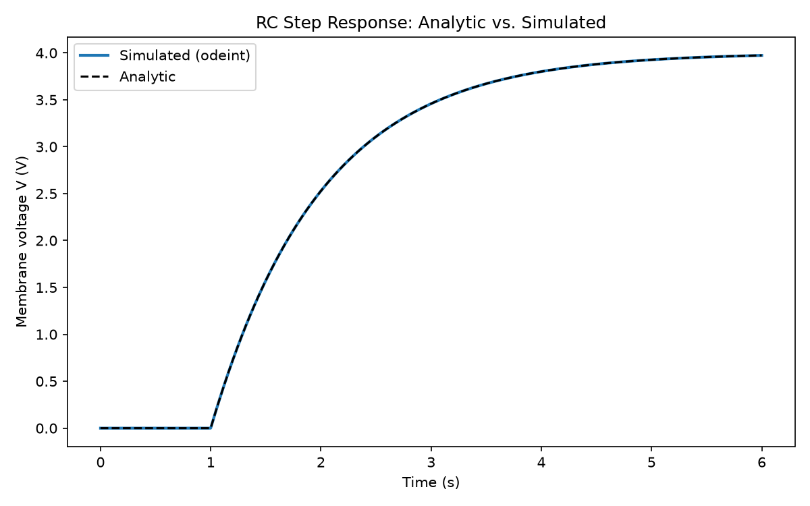
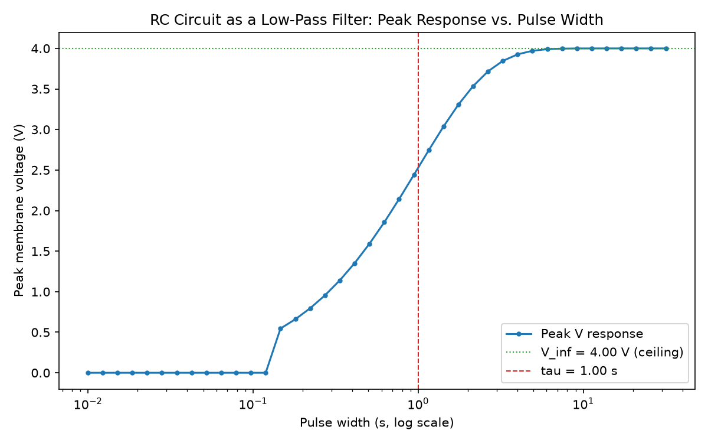
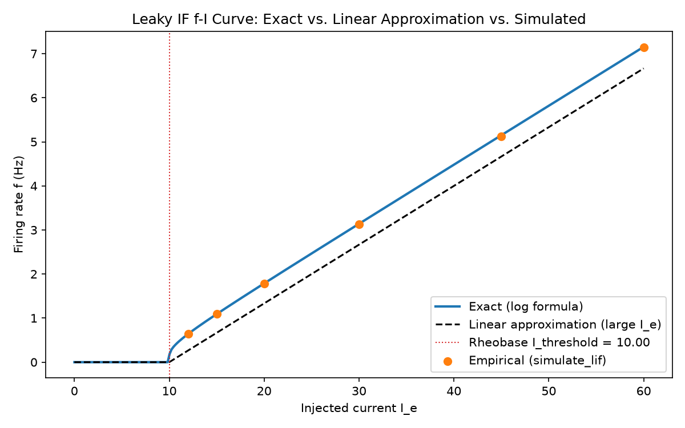
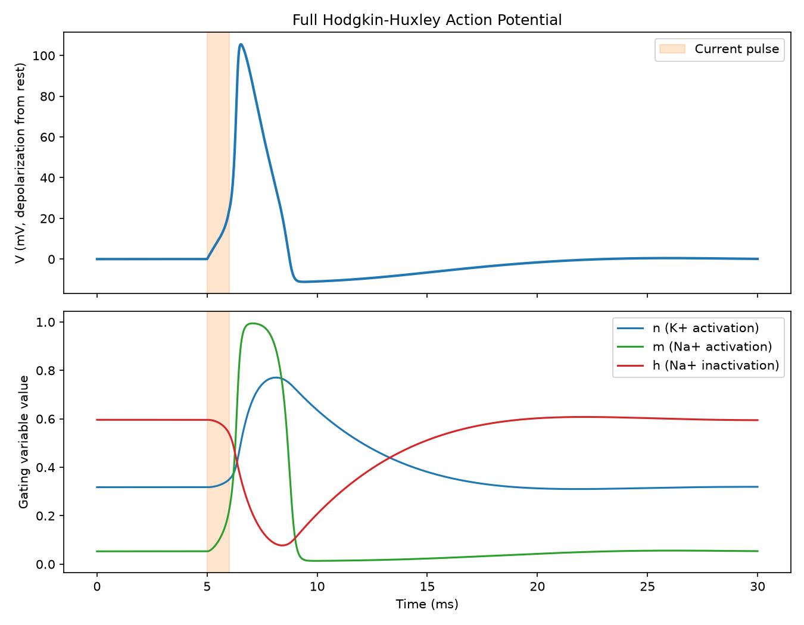
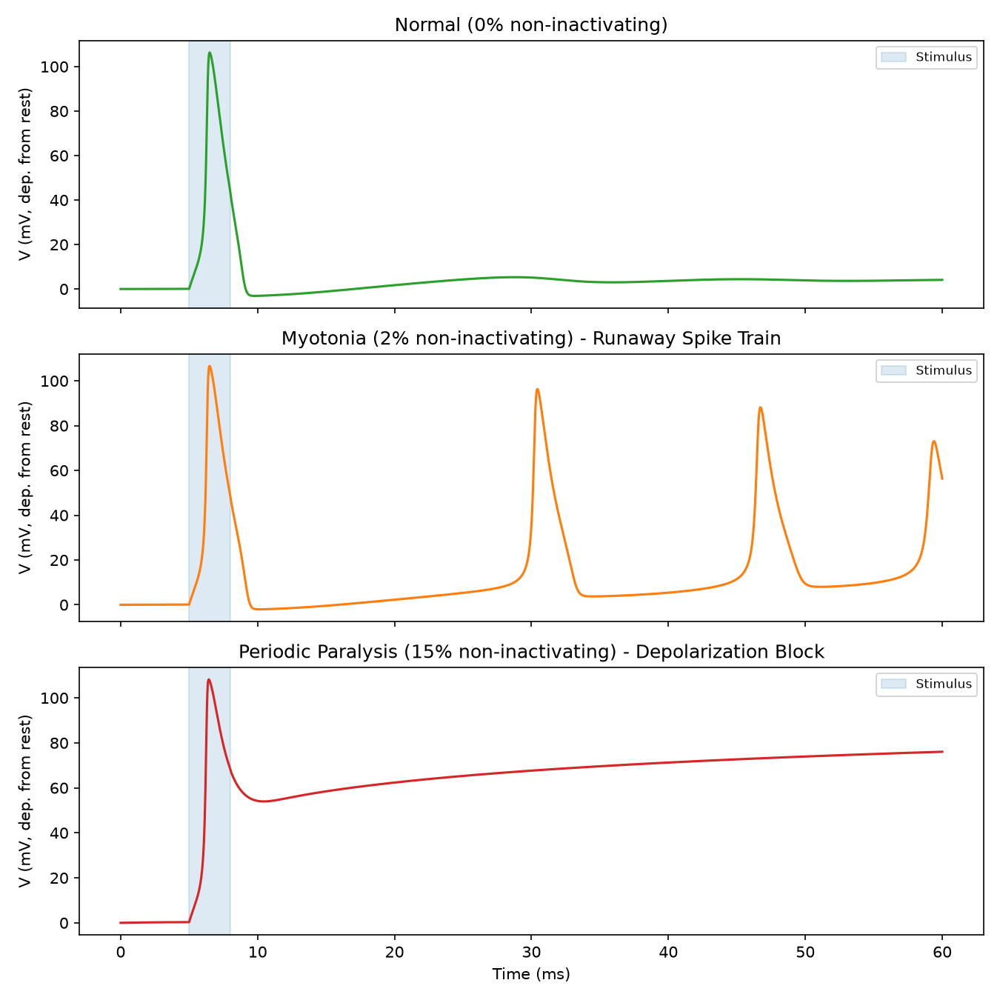

# Neural Computation — From Ions to Spikes

I'm working through [MIT OCW 9.40 (Introduction to Neural Computation)](https://ocw.mit.edu/)
on my own, and building a small simulation project for each lecture as I go,
to make sure I actually understand the material instead of just recognizing
the formulas.

The eventual goal is to end up with a simulated spiking neuron
(Hodgkin-Huxley model) built from scratch, but I'm taking it one lecture at
a time and only building each piece once I've actually covered it in the
course.

## Roadmap

- [x] **Lecture 1 — Ionic Diffusion & Drift**: random walk simulation, Fick's
  First Law, Ohm's Law in solution →
  [`lectures/01-ionic-diffusion-drift`](lectures/01-ionic-diffusion-drift)
- [x] **Lecture 2 — The RC Model of a Neuron**: passive membrane, membrane
  time constant, low-pass filtering, and the Nernst (equilibrium) potential →
  [`lectures/02-rc-neuron`](lectures/02-rc-neuron)
- [x] **Lecture 3 — Ion-Specific Conductances and Integrate-and-Fire Models**:
  reversal/driving-potential framework (each ion conductance modeled as a
  resistor in series with a battery), then the Integrate-and-Fire spiking
  model and its firing-rate-vs-injected-current derivation, including the
  rheobase (minimum current needed to spike at all) →
  [`lectures/03-integrate-and-fire`](lectures/03-integrate-and-fire)
- [x] **Lecture 4/5 — Hodgkin-Huxley**: voltage-gated sodium and potassium
  conductances built from gating variables, assembled into the full
  coupled spiking model, and applied to a real disease (sodium channel
  myotonia and periodic paralysis) as a case study in turning a word
  model into equations →
  [`lectures/04-05-hodgkin-huxley`](lectures/04-05-hodgkin-huxley)

Each lecture got its own folder and its own README with more detail as I
went through the course. This README (and the roadmap above) reflects the
finished repo — see the note on scope at the bottom for why it stops here.

## Project structure

```
neural-computation-sim/
└── lectures/
    ├── shared/
    │   ├── plotting_utils.py       # get_figures_dir() - lecture-agnostic helper
    │   ├── circuit_utils.py        # RC circuit building blocks reused across Lecture 2 and 3
    ├── 01-ionic-diffusion-drift/
    ├── 02-rc-neuron/
    ├── 03-integrate-and-fire/
    └── 04-05-hodgkin-huxley/
```

`shared/` holds code that isn't specific to any one lecture's topic and
would otherwise get duplicated (or, worse, drift out of sync) across
lecture folders. It's installed as an editable package (see Setup below)
so every lecture folder can import from it with a plain
`from shared.plotting_utils import get_figures_dir`, no matter which
directory a script is actually run from.

`plotting_utils.py` is the one every lecture needs regardless of topic (a
helper that makes sure figures save next to the script that made them, not
wherever the terminal happened to be `cd`'d into).

`circuit_utils.py` is newer — it originally lived only in Lecture 2's
`utils.py`, but once Lecture 3 needed the same RC machinery (current
waveform generators, `tau`/`V_inf`, the `odeint`-based simulator), I pulled
it out to `shared/` rather than reaching into Lecture 2's folder from
Lecture 3 or copy-pasting the same functions (and the same `odeint`
discontinuity bug, see the Lecture 2 README) a second time. Lecture 2's
`utils.py` was updated to re-export from here instead of defining its own
copies — same function names and signatures, just relocated, so nothing
in Lecture 2's scripts had to change.

Everything else — simulation logic, plotting, demos — is lecture-specific
and lives in that lecture's own folder. Each lecture folder has its own
`utils.py` for helpers that get reused across that lecture's scripts (e.g.
`simulate_random_walks` in Lecture 1, `simulate_lif` in Lecture 3, the full
Hodgkin-Huxley gating/integration machinery in Lecture 4/5). Lecture-specific
`utils.py` files re-export whatever they need from `shared/`, so within a
lecture folder everything can still be pulled from one local `from utils
import ...`, and each lecture folder only ever imports from `shared/` —
never from another lecture's folder — so every folder stays self-sufficient
as long as `shared/` is present.

## Setup

```bash
pip install -r requirements.txt
pip install -e .              # installs the shared/ package in editable mode
```

The second command is what makes `from shared.plotting_utils import
get_figures_dir` resolve correctly from inside any lecture folder.

## Module 1: Ionic Diffusion & Drift

My first project, covering the two mechanisms that move ions in solution —
random diffusion and electrically-driven drift. I simulated each one from
scratch (particle-by-particle) instead of just plugging numbers into the
formulas from the slides, to actually see the behavior the equations are
describing.

**`random_walk.py`** — simulates many particles doing independent 1D random
walks, then checks that:
- ⟨x⟩ ≈ 0 over time (diffusion is unbiased — no net drift)
- ⟨x²⟩ = 2Dt (mean squared displacement grows linearly with time)
- The diffusion coefficient D I get from fitting the simulated data matches
  the theoretical D = δ²/(2τ) from the step size and step duration I chose


**`diffusion_fick.py`** — simulates diffusion starting from a clustered
"drop of dye," then builds a concentration profile and flux straight from
where the particles ended up (histogram + finite differences), to see
Fick's First Law (J = -D·∂C/∂x) show up on its own from a bunch of random
walkers, instead of assuming the continuum equation from the start.


**`drift_ohms_law.py`** — looks at how resistance scales with geometry
(R = ρL/A), and compares plain diffusion against a biased "drift" random
walk side by side. This was the plot I most wanted to see for myself:
diffusion's mean position stays near zero while its spread grows as √t,
but drift's mean position grows in a straight line with t — apparently
that's the signature that tells you whether particles are just diffusing
or being pushed by a field.


**`utils.py`** — the simulation code shared across all three scripts above,
so I wasn't copy-pasting the same random walk logic everywhere.

More detail (including bugs I ran into and things I'm still unsure about)
is in the [Lecture 1 README](lectures/01-ionic-diffusion-drift/README.md).

## Module 2: The RC Model of a Neuron

Second project — building up a neuron's passive electrical model from
scratch, piece by piece: a bare capacitor first (and seeing why that alone
is a "dead neuron"), then adding a leak resistor, then using that RC
circuit to demonstrate low-pass filtering, and finally deriving the
Nernst equilibrium potential — the "battery" a neuron needs to generate
its own resting potential.

**`capacitor_model.py`** — the zeroth-order model: just a capacitor, no
resistor. Confirms that a step current produces a linear voltage ramp, a
ramp current produces a parabolic voltage profile, and — most importantly
— that voltage never returns to baseline once current stops. That's the
"dead neuron" limitation that motivates adding a resistor next.

**`rc_model.py`** — the real passive membrane model: capacitor + leak
resistor, giving the governing equation τ·dV/dt = -(V - V∞). Numerically
integrates this with `scipy.integrate.odeint` and checks it against the
closed-form exponential solution. Also explicitly verifies that at t=τ,
the voltage has closed ~63% (1 - 1/e) of the gap to V∞ — the defining
property of the time constant.



**`low_pass_filter.py`** — sweeps current-pulse width from far below τ to
far above τ, and plots peak voltage response vs. pulse width. This is the
plot that actually shows *why* an RC neuron behaves like a low-pass filter:
short pulses barely move the voltage before they end, long pulses have
time to approach V∞.



**`nernst_potential.py`** — derives the equilibrium (Nernst) potential via
the Boltzmann-distribution route from the lecture, and checks it against
the classic squid giant axon numbers (E_K ≈ -75 mV). Also includes a
particle-level diffusion-vs-drift simulation reusing Lecture 1's random
walk mechanics, to connect the Nernst potential back to the same
diffusion/drift competition rather than treating it as an unrelated new
formula.

**`utils.py`** — shared helpers across the four scripts above:
`step_current`/`pulse_current` generators, `tau_from_RC`,
`V_inf_from_current`, and `simulate_rc_response` (the `odeint` wrapper).

More detail — including a real bug I hit (a sign error in the Nernst
equation that flipped E_K positive) and a subtler one (`odeint` silently
skipping over a current pulse entirely for certain pulse widths) — is in
the [Lecture 2 README](lectures/02-rc-neuron/README.md).

## Module 3: Ion-Specific Conductances and Integrate-and-Fire Models

Third project. Lecture 3 does two things: it fixes the last piece missing
from Lecture 2's RC model (an ion conductance is a resistor *in series with
a battery*, not just a resistor — that's what gives a neuron a real resting
potential instead of an arbitrary starting voltage), and then sets the
passive membrane model aside in favor of a much simpler spiking model —
integrate-and-fire — building up its firing-rate-vs-current relationship
from scratch, including a genuinely new phenomenon the leak introduces: a
minimum current (rheobase) below which the neuron never fires at all.

**`conductance_battery.py`** — models an ion conductance as
`I_ion = G_ion * (V - E_ion)` (driving-potential form), shows the I-V curve
crossing zero at `E_ion` rather than at V=0, and re-derives Lecture 2's RC
equation with `V_inf` now offset by the battery voltage. Directly fixes the
"dead neuron" behavior from `capacitor_model.py`: with the leak's battery
in place, the membrane relaxes back to a genuine resting potential
(`E_leak`) instead of freezing wherever it stopped.

**`integrate_and_fire.py`** — the leaky and no-leak integrate-and-fire
spiking models: hard voltage threshold, then instant reset. Confirms
regular periodic firing under constant current in both cases, and confirms
the leaky model's qualitatively new behavior — below the rheobase current,
`V` just settles at `V_inf` and never reaches threshold, no matter how long
current is injected.

**`firing_rate_curve.py`** — sweeps injected current across a range
spanning below and above rheobase, and compares the exact closed-form
firing rate (from solving the leaky IF ODE for the inter-spike interval)
against the large-current linear approximation from the lecture. Also
actually runs `simulate_lif` at several current values and checks the
resulting empirical firing rate against the exact formula, rather than
just trusting that the closed-form algebra is right because it looks
right — all empirical points matched to within ~0.02 Hz.



**`utils.py`** — shared helpers for this lecture's three scripts:
`driving_potential`, `ionic_current`, `rheobase_current`, `simulate_lif`
(the threshold-and-reset simulator — `odeint` alone can't do a reset event
mid-integration, so this steps the ODE forward chunk-by-chunk between
spikes), and the three firing-rate functions (`firing_rate_no_leak`,
`firing_rate_leaky_exact`, `firing_rate_leaky_linear_approx`). Re-exports
`step_current`, `pulse_current`, `tau_from_RC`, `V_inf_from_current`, and
`simulate_rc_response` from `shared/circuit_utils.py` rather than
redefining them.

More detail is in the
[Lecture 3 README](lectures/03-integrate-and-fire/README.md).

## Module 4/5: The Hodgkin-Huxley Model

Fourth and final project. Lectures 4 and 5 replace Lecture 3's
threshold-and-reset spike rule with the real thing: sodium and potassium
conductances built from voltage- and time-dependent gating variables,
coupled back into the membrane equation they themselves depend on, so
spiking becomes an emergent property of the system rather than an assumed
rule bolted on from outside. Lecture 4 works out potassium's gating
variable; Lecture 5 works out sodium's (which turns out to need two gates,
not one), assembles the full model, and spends its second half modeling a
real disease end-to-end.

**`gating_kinetics.py`** — the math every gate shares: `alpha(V)`,
`beta(V)` in, `(x_inf, tau_x)` out. Confirms `n_inf`/`m_inf` rise with
depolarization while `h_inf` falls (mirror-image sigmoids), and that `m`
is much faster than `n` or `h` — the quantitative reason sodium activates
fast while potassium activation and sodium inactivation are both slow.

**`potassium_conductance.py`** — simulates `n`'s step response and
`G_K = G_K_bar * n^4`, confirming the "delayed rectifier" shape: turns on
and stays on for as long as depolarization holds.

**`sodium_conductance.py`** — simulates `m` and `h` separately under the
same step, multiplies them into `G_Na = G_Na_bar * m^3 * h`, and shows the
product reproduces sodium's transient rise-then-decay current — something
a single gate can never produce alone. Also isolates the separate
driving-force effect that makes peak sodium current collapse near `E_Na`,
independent of inactivation.

**`action_potential.py`** — the centerpiece: integrates the full coupled
`V`/`n`/`m`/`h` system and confirms a brief current pulse alone produces a
complete action potential (peak ~+40 mV absolute, matching the classic
textbook number) with no spike rule anywhere in the code. A control with
`G_Na` forced to zero confirms the spike genuinely depends on the
sodium/potassium feedback loop, not just "current in, voltage out."



**`refractory_period.py`** — a two-pulse protocol confirming the
refractory period is graded, not a hard cutoff: the minimum current needed
to trigger a second spike starts very high right after the first spike and
decreases smoothly back toward baseline as the inactivation gate recovers.

**`myotonia_model.py`** — the disease capstone. Extends the model with a
t-tubule potassium-accumulation compartment and sweeps one parameter (the
fraction of sodium channels failing to inactivate) to reproduce two
clinically opposite phenotypes from a single mechanism: a small failure
fraction produces a myotonic run (repeated spikes continuing after the
stimulus stops), a larger one produces depolarization block (voltage locks
high and flat) — periodic paralysis.



**`utils.py`** — the Hodgkin-Huxley rate functions, gating kinetics, and
full coupled integrator used across all six scripts above. Kept local to
this folder rather than added to `shared/`, since nothing outside this
lecture needs it.

More detail — including a genuinely subtle 1000x unit bug in the t-tubule
model and how I tracked it down — is in the
[Lecture 4/5 README](lectures/04-05-hodgkin-huxley/README.md).

### Running it

```bash
pip install -r requirements.txt
pip install -e .

cd lectures/01-ionic-diffusion-drift
python random_walk.py
python diffusion_fick.py
python drift_ohms_law.py

cd ../02-rc-neuron
python capacitor_model.py
python rc_model.py
python low_pass_filter.py
python nernst_potential.py

cd ../03-integrate-and-fire
python conductance_battery.py
python integrate_and_fire.py
python firing_rate_curve.py

cd ../04-05-hodgkin-huxley
python gating_kinetics.py
python potassium_conductance.py
python sodium_conductance.py
python action_potential.py
python refractory_period.py
python myotonia_model.py
```

Each script has `# %%` cell markers so I could run them cell-by-cell in
VS Code with the Jupyter extension, instead of re-running the whole
simulation every time I wanted to tweak a parameter.

## A note on scope

This repo is capped at Lecture 5 (Hodgkin-Huxley model, finished across
Lectures 4-5). Coding up every lecture from here on would turn into
busywork rather than something that's actually useful to show —
reproducing textbook derivations in code is good for learning, but past a
certain point it stops being differentiated portfolio work. I'll keep
watching 9.40 on my own after this, just without a matching folder for
every lecture. The next project will likely involve real EEG data and
reproducing a published BCI decoding paper, which is a better use of that
kind of time.